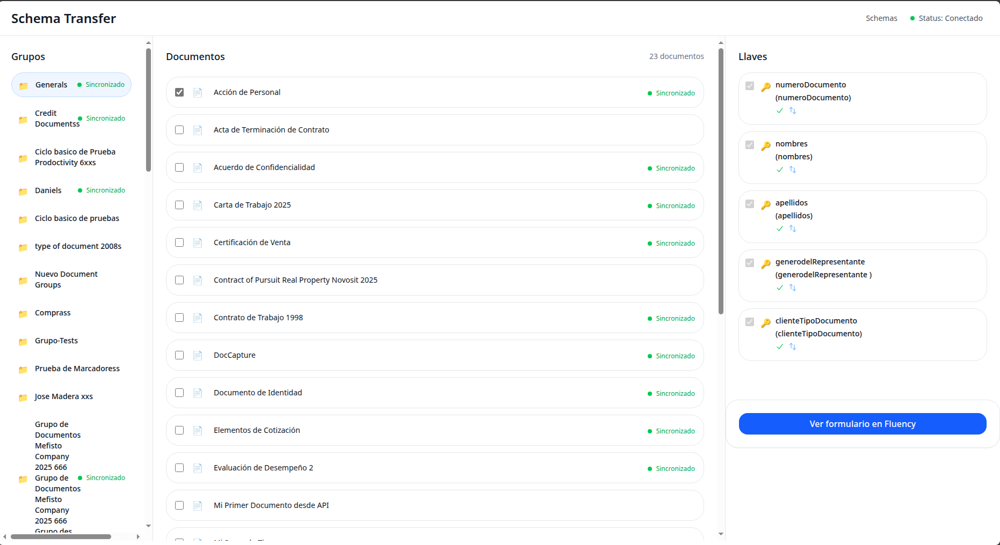

# Prodoctivity Schema Transfer



This tool allows you to quickly and efficiently migrate and update document structures, users, workflows, and permissions between the Prodoctivity Fluency (V5) and Prodoctivity Cloud (V6) systems.

It relies on the APIs of each platform and uses an intermediate validation system that translates instructions and data types to the corresponding source and destination systems.

In addition to migration, this solution facilitates data compatibility between versions: it allows information to be adapted from V6 to V5 and vice versa, which is especially useful for integrating systems that are not directly compatible, such as Prodoctivity Capture.

This ensures that information and configuration remain consistent during migration or synchronization processes, reducing errors, speeding up the process, and allowing organizations to adopt more modern environments without losing interoperability with existing systems.

Additionally, the system offers:


* Security in data transfer.

* Automatic validation of structures before migration or conversion.

* Detailed reports on the progress and status of processes.

##
```
ProdoctivitySchemaTransfer/
├── backend/                 # Backend services and API
│   ├── packages/            # Monorepo packages
│   │   ├── Core/            # Core functionality
│   │   ├── Prodoctivity5/   # Prodoctivity 5 specific code
│   │   ├── ProdoctivityCloud/ # Prodoctivity Cloud specific code
│   │   ├── Test/            # Test utilities
│   │   └── server/          # API server implementation
│   ├── bun.lock            # Bun lock file
│   └── package.json        # Root package.json
│
├── frontend/               # Angular-based frontend
│   ├── src/
│   │   ├── app/
│   │   │   ├── pages/      # Application pages
│   │   │   ├── services/   # Frontend services
│   │   │   └── shared/     # Shared components and utilities
│   │   └── environments/   # Environment configurations
│   └── package.json        # Frontend dependencies
│
└── documentations/         # Project documentation
```

## Prerequisites
* Node.js (v18 or later)
* Bun (v1.2.19 or later)
* Angular CLI +18 (for frontend development)

## Getting Started

### Backend Setup
1. Navigate to the backend directory:
    ```bash
    cd backend
    ```
2. Install dependencies:
    ```bash
    bun install
    ```
3. Start the development server:
    ```bash
    bun run run_serve
    ```
4. open the browser in http://localhost:3000 or http://localhost:3000/swagger for view documentation

### Frontend Setup
1. Navigate to the frontend directory:
    ```bash
    cd frontend
    ```
2. Install dependencies:
    ```bash
    npm install
    ```
3. Start the development server:
    ```
    ng serve
    ```
4. Open your browser and navigate to http://localhost:4200/

## Development

### Backend Development
The backend is built using a monorepo structure with the following key packages:

* Core: Shared functionality and utilities
* Prodoctivity5: Prodoctivity 5 specific implementations
* ProdoctivityCloud: Prodoctivity Cloud specific implementations
* Server: API server implementation

### Frontend Development
The frontend is an Angular application with the following structure:

* Pages: Main application views
* Services: API services and business logic
* Shared: Reusable components and utilities

## Scripts

### Backend
* ```bun install```: Install dependencies
* ```bun test```: Run tests
* ```bun run run_api```: Start the API server
### Frontend
* ```ng serve```: Start the development server
* ```ng build```: Build the application
* ```ng test```: Run tests

## Publish

### Backend
For publish:

1. Navigate to backend folder:
    ```bash
    cd backend
    ```
2. Run the command:
    ``` bash
    bun run build:exec
    ```
Note : if required run backend as windows service read [this](/documentations/InstallServiceBackend.MD) guide
### Frontend
For publish:
1. Navigate to frontend folder:
    ```bash
    cd frontend
    ```
2. Run the command:
    ```bash
    ng build
    ```

## Contributing
1. Fork the repository
2. Create your feature branch (```git checkout -b feature/AmazingFeature```)
3. Commit your changes (```git commit -m 'Add some AmazingFeature'```)
4. Push to the branch (```git push origin feature/AmazingFeature```)
5. Open a Pull Request


## Support
For support, please open an issue in the repository.